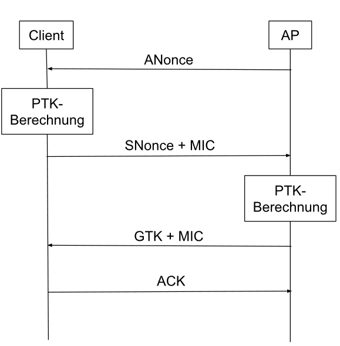

## Personal Mode
Authentifizierung über PSK (Pre-Shared Key) - muss vor Anmeldung eines Clients am Access Point hinterlegt werden.

## Enterprise Mode
802.1x/Radius-/AAA-Server ([EAP - Extensible Authentication Protocol](EAP%20-%20Extensible%20Authentication%20Protocol)) -> Benutzerdaten
1. Authentifizierung gegenüber Radius-Server
2. Radius-Server & Client generieren Master Key (MK)
3. PMK (Pre-Shared-Master-Key) wird abgeleitet
4. Radius-Server übermittelt PMK an dAP
5. 4-Wege-Handshake
### Vorteile:
Mehrere APs mit unterbrechungsfreiem Wechsel möglich
Da jedes Mal neuer PMK von MK abgeleitet wird, hilft Abfangen des 4-Wege-Handshakes oder PMKID im WPA2 Enterprise Mode **nicht**.

## Schlüssel
**WPA-2 verwendet synchrone Verschlüsselung!**
- Pairwise Master Key (PMK)
	- Das "Passwort"
	- Password Based Key Derivation Function 2 (PBKDF2)
		PMK wird mittels PBKDF2 aus PSK, ESSID und len(ESSID) berechnet
		*Im Enterprise Mode wird der PMK temporär durch das Protokoll des Authentifizierungsserver gestellt
	- PTK wird aus PMK abgeleitet
- Pairwise Transient Key (PTK)
	- 512 Bits
	- Wird über Pseudozufallsfunktion (PRF) berechnet
	- Synchrone Schlüssel (für Übertragung) werden aus PTK abgeleitet
	- Besteht aus:
		- Key Confirmation Key (KCK)
			- 128 Bits
			- für Message Integrity Codes (MIC)
		- Key Encryption Key (KEK)
			- 128 Bits
			- für Vertraulichkeit ([Integrity](Integrity))
		- Temporary KEY (TK)
			- 128 Bits
			- Für Verschlüsselung der Daten zwischen Client und AP
		- Temporary MIC Tx Key AP
			- 64 Bits
			- Für Generierung der MIC über AP-seitige Pakete
		- Temporary MIC Rx Key Client
			- 64 Bits
			- Für Generierung der MIC über Client-seitige Pakete
- Groupwise Transient Key (GTK)
	- Dient der Multicast-Kommunikation zwischen mehreren Clients
	- Durch zufällige Wahl der GNonce durch den Server erhält jeder Client einen eigenen GTK
## 4-Wege-Handshake
Zur Etablierung des gemeinsamen PTKs und des GTKs.
Verwendet wird das [Extensible Authentication Protocol over LAN (EAPOL)](Extensible%20Authentication%20Protocol%20over%20LAN%20(EAPOL)).

1. **1. Nachricht**: Der AP sendet generierte zufallszahl *ANonce* and Client
2. Client wählt Zufallszahl *SNonce* und berechnet PTK
	`PTK = PRF(PMK + ANonce + SNonce + MAC-Adresse AP + MAC-Adresse Client)`
3. **2. Nachricht**: Client sendet *SNonce* und Message Integrity Code (MIC)
4. AP berechnet PTK und leitet daraus die weiteren temporären Schlüssel ab. Diese werden dazu verwendet, den mitgesendeten MIC zu überprüfen.
5. **3. Nachricht**: AP übermittelt GTK, GTK-Sequenznummer und MIC. (Der KEK wird verwendet um GTK zu verschlüsseln)
6. **4. Nachricht**: Client bestätigt GTK durch GTK-Sequenznummer und entsprechenden MIC. AP überprüft MIC und installiert GTK
## [WPA2 Angriffe Überblick](WPA2%20Angriffe%20Überblick.md)
